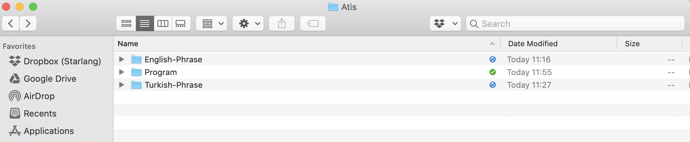
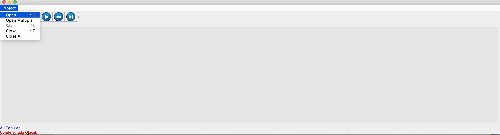
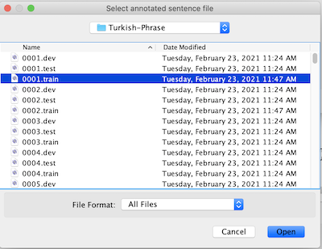
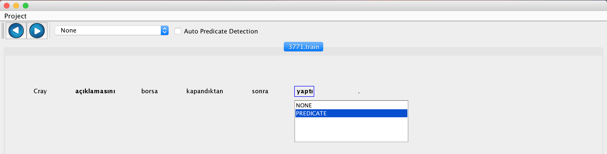
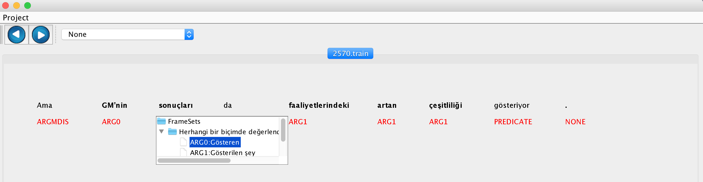
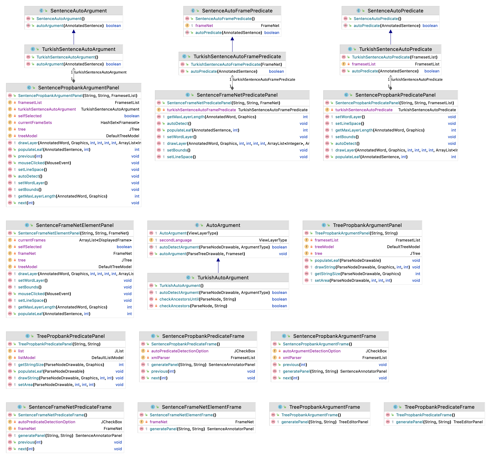

# Semantic Role Labeling

## Task Definition

Semantic Role Labeling (SRL) is a well-defined task where the objective is to analyze propositions expressed by the verb. In SRL, each word that bears a semantic role in the sentence has to be identified. There are different types of arguments (also called ’thematic roles’) such as Agent, Patient, Instrument, and also of adjuncts, such as Locative, Temporal, Manner, and Cause. These arguments and adjuncts represent entities participating in the event and give information about the event characteristics.

In the field of SRL, PropBank is one of the studies widely recognized by the computational linguistics communities. PropBank is the bank of propositions where predicate- argument information of the corpora is annotated, and the semantic roles or arguments that each verb can take are posited.

Each verb has a frame file, which contains arguments applicable to that verb. Frame files may include more than one roleset with respect to the senses of the given verb. In the roleset of a verb sense, argument labels Arg0 to Arg5 are described according to the meaning of the verb. For the example below, the predicate is “announce” from PropBank, Arg0 is “announcer”, Arg1 is “entity announced”, and ArgM- TMP is “time attribute”.

[ARG0 Türk Hava Yolları] [ARG1 indirimli satışlarını] [ARGM-TMP bu Pazartesi] [PREDICATE açıkladı].

[ARG0 Turkish Airlines] [PREDICATE announced] [ARG1 its discounted fares] [ARGM-TMP this Monday].

The following Table shows typical semantic role types. Only Arg0 and Arg1 indicate the same thematic roles across different verbs: Arg0 stands for the Agent or Causer and Arg1 is the Patient or Theme. The rest of the thematic roles can vary across different verbs. They can stand for Instrument, Start point, End point, Beneficiary, or Attribute. Moreover, PropBank uses ArgM’s as modifier labels indicating time, location, temporal, goal, cause etc., where the role is not specific to a single verb group; it generalizes over the entire corpus instead.

|Tag|Meaning|
|---|---|
|Arg0|Agent or Causer|
|ArgM-EXT|Extent|
|Arg1|Patient or Theme|
|ArgM-LOC|Locatives|
|Arg2|Instrument, start point, end point, beneficiary, or attribute|
|ArgM-CAU|Cause|
|ArgM-MNR|Manner|
|ArgM-DIS|Discourse|
|ArgM-ADV|Adverbials|
|ArgM-DIR|Directionals|
|ArgM-PNC|Purpose|
|ArgM-TMP|Temporals|

## Data Annotation

### Preparation

1. Collect a set of sentences to annotate. 
2. Each sentence in the collection must be named as xxxx.yyyyy in increasing order. For example, the first sentence to be annotated will be 0001.train, the second 0002.train, etc.
3. Put the sentences in the same folder such as *Turkish-Phrase*.
4. Build the project and put the generated sentence-propbank-predicate.jar and sentence-propbank-argument.jar files into another folder such as *Program*.
5. Put *Turkish-Phrase* and *Program* folders into a parent folder.

### Predicate Annotation

1. Open sentence-propbank-predicate.jar file.
2. Wait until the data load message is displayed.
3. Click Open button in the Project menu.

4. Choose a file for annotation from the folder *Turkish-Phrase*.  

5. For each predicate word in the sentence, click the word, and choose PREDICATE tag for that word.

6. Click one of the next buttons to go to other files.

### Argument Annotation

1. Open sentence-propbank-argument.jar file.
2. Wait until the data load message is displayed.
3. Click Open button in the Project menu.

4. Choose a file for annotation from the folder *Turkish-Phrase*.  

5. For each word in the sentence, click the word, and choose correct argument tag for that word.

6. Click one of the next buttons to go to other files.

## Classification DataSet Generation

After annotating sentences, you can use [DataGenerator](https://github.com/starlangsoftware/DataGenerator) package to generate classification dataset for the Semantic Role Labeling task.

## Generation of ML Models

After generating the classification dataset as above, one can use the [Classification](https://github.com/starlangsoftware/Classification) package to generate machine learning models for the Semantic Role Labeling task.

Class Diagram
============

For Developers
============

You can also see [Python](https://github.com/starlangsoftware/SemanticRoleLabeling-Py), [Cython](https://github.com/starlangsoftware/SemanticRoleLabeling-Cy), [C++](https://github.com/starlangsoftware/SemanticRoleLabeling-CPP), [Js](https://github.com/starlangsoftware/SemanticRoleLabeling-Js), [Swift](https://github.com/starlangsoftware/SemanticRoleLabeling-Swift), or [C#](https://github.com/starlangsoftware/SemanticRoleLabeling-CS) repository.

## Requirements

* [Java Development Kit 8 or higher](#java), Open JDK or Oracle JDK
* [Maven](#maven)
* [Git](#git)

### Java 

To check if you have a compatible version of Java installed, use the following command:

    java -version
    
If you don't have a compatible version, you can download either [Oracle JDK](https://www.oracle.com/technetwork/java/javase/downloads/jdk8-downloads-2133151.html) or [OpenJDK](https://openjdk.java.net/install/)    

### Maven
To check if you have Maven installed, use the following command:

    mvn --version
    
To install Maven, you can follow the instructions [here](https://maven.apache.org/install.html).      

### Git

Install the [latest version of Git](https://git-scm.com/book/en/v2/Getting-Started-Installing-Git).

## Download Code

In order to work on code, create a fork from GitHub page. 
Use Git for cloning the code to your local or below line for Ubuntu:

	git clone <your-fork-git-link>

A directory called SemanticRoleLabeling will be created. Or you can use below link for exploring the code:

	git clone https://github.com/olcaytaner/SemanticRoleLabeling.git

## Open project with IntelliJ IDEA

Steps for opening the cloned project:

* Start IDE
* Select **File | Open** from main menu
* Choose `SemanticRoleLabeling/pom.xml` file
* Select open as project option
* Couple of seconds, dependencies with Maven will be downloaded. 

## Compile

**From IDE**

After being done with the downloading and Maven indexing, select **Build Project** option from **Build** menu. After compilation process, user can run SemanticRoleLabeling.

**From Console**

Go to `SemanticRoleLabeling` directory and compile with 

     mvn compile 

## Generating jar files

**From IDE**

Use `package` of 'Lifecycle' from maven window on the right and from `SemanticRoleLabeling` root module.

**From Console**

Use below line to generate jar file:

     mvn install

## Maven Usage

        <dependency>
            <groupId>io.github.starlangsoftware</groupId>
            <artifactId>SemanticRoleLabeling</artifactId>
            <version>1.0.1</version>
        </dependency>

Detailed Description
============

The first task in Semantic Role Labeling is detecting predicates. In order to detect the predicates of the sentence, we use autoPredicate method of the TurkishSentenceAutoPredicate class.

	AnnotatedSentence sentence = ...
	TurkishSentenceAutoPredicate turkishAutoPredicate = new TurkishSentenceAutoPredicate(new FramesetList());
	turkishAutoPredicate.autoPredicate(sentence);
	
Afterwards, one has to annotate the arguments for each predicate. We use autoArgument method of the TurkishSentenceAutoArgument class for that purpose.

	TurkishSentenceAutoArgument turkishAutoArgument;
	turkishAutoArgument.autoArgument(sentence);

# Cite

	@article{tbtkelektrik400987,
	journal = {Turkish Journal of Electrical Engineering and Computer Science},
	issn = {1300-0632},
	eissn = {1303-6203},
	address = {},
	publisher = {TÜBİTAK},
	year = {2018},
	volume = {26},
	pages = {570 - 581},
	doi = {},
	title = {Construction of a Turkish proposition bank},
	key = {cite},
	author = {Ak,  Koray and Toprak,  Cansu and Esgel,  Volkan and Yıldız,  Olcay Taner}
	}
